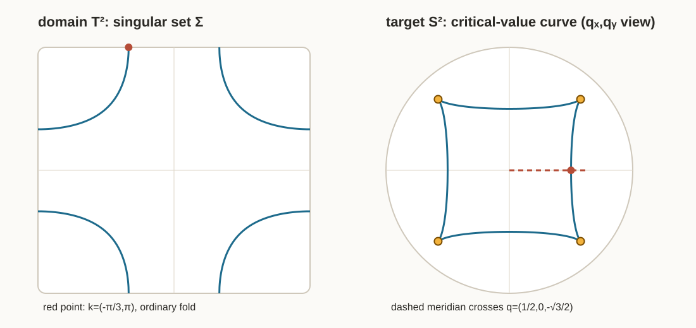

# 구면의 양의 곡률면적이 토러스에서 뒤집히는 순간

## winding form 적분에서 two-band map의 fold와 cusp까지

> 오늘 처음 계산할 것은 Hamiltonian도 projector도 아니다. 반지름 $R$인 원을
> $\gamma_m(t)=(R\cos mt,R\sin mt)$, $0\le t\le2\pi$
> 로 $m$번 돌고
> $\displaystyle
> \oint_{\gamma_m}\frac{-Y\,dX+X\,dY}{X^2+Y^2}=2\pi m$
> 을 얻는 일이다.
>
> 그다음 같은 적분을 $-\oint *du$, $\int K\,dA$,
> $\int f^*\omega_{\mathrm{FS}}$, regular value의 원상 주위 winding으로
> 차례로 다시 읽는다. 독자가 two-band 계산에 도착했을 때에는
> “새 적분이 아니라, 부호를 가진 winding form을 또 적분하는구나”라고
> 느껴야 한다.
>
> 정리나 필연성은 마지막이다. 먼저 실제 대각선 $k(t)=(t,t)$에서
> $\bar\lambda(0,0)=\frac12$,
> $\bar\lambda(\frac\pi2,\frac\pi2)=0$,
> $\bar\lambda(\pi,\pi)=-\frac1{18}$
> 을 계산하여, 구면의 양의 곡률면적을 $f$가 같은 방향으로 옮기다가
> 한 번 납작해지고, 그 뒤 뒤집어 옮기는 장면부터 본다.

---

## 이 노트에서 사실의 출처를 읽는 법

- **[논문]** Huang, *A Gauss-Bonnet Theorem for Quantum States*의 식 또는 명시적 주장이다.
- **[유도]** 논문의 실제 $d(k)$를 넣어 이 노트에서 전개한 식이다.
- **[수치]** 아래 검산 스크립트가 독립적으로 계산한 근 또는 적분 근삿값이다.
- **[검산]** 다른 계산 경로와 맞춰 본 결과다.

논문: [arXiv 2510.15760](https://arxiv.org/abs/2510.15760) · [HTML 원문](https://arxiv.org/html/2510.15760v1)

독립 검산:

$$
\texttt{python verify\_two\_band\_fold\_trace.py
--write-svg assets/two\_band\_fold\_sheet\_trace.svg}
$$

---

# 0. 긴 워밍업 — 끝까지 남는 계산은 winding form 적분이다

이 절에서는 아직 논문의 $d(k)$를 쓰지 않는다. 미적분학에서 이미 아는
원, 로그, Jacobian만으로 이후 계산에 나오는 모든 부호를 먼저 목격한다.

## W1. 원을 한 번 돌면 왜 $2\pi$인가

원점을 뺀 평면에 1-form

$$
\vartheta=\frac{-Y\,dX+X\,dY}{X^2+Y^2}
$$

를 둔다. $\vartheta$는 국소적으로 $d\arg(X+iY)$다. 그러나 원점을
한 바퀴 도는 영역 전체에서는 $\arg$를 한 값으로 고를 수 없으므로,
$\vartheta$를 전역적인 $d$(한 값 함수)라고 생각하면 안 된다.

반지름 $R>0$인 원을 반시계로 $m$번 도는 곡선

$$
\gamma_m(t)=(R\cos mt,R\sin mt),\qquad 0\le t\le2\pi
$$

에 직접 대입한다.

$$
X=R\cos mt,\quad Y=R\sin mt,\quad
dX=-Rm\sin mt\,dt,\quad dY=Rm\cos mt\,dt.
$$

따라서

$$
\begin{aligned}
\gamma_m^*\vartheta
&=\frac{-R\sin mt(-Rm\sin mt\,dt)
+R\cos mt(Rm\cos mt\,dt)}{R^2}\\
&=m\,dt,
\end{aligned}
$$

$$
\boxed{\oint_{\gamma_m}\vartheta=2\pi m.}
\tag{W1}
$$

반시계 한 바퀴는 $+2\pi$, 시계 한 바퀴는 $-2\pi$다. 반지름은
사라진다. 이 적분은 크기가 아니라 감긴 횟수를 센다.

## W2. $-m\log r$의 경계 flux는 같은 적분이다

orientation을 $dX\wedge dY$로 고정하고

$$
*dX=dY,\qquad *dY=-dX
$$

로 둔다. $r=\sqrt{X^2+Y^2}$, $u_m=-m\log r$이면

$$
du_m=-m\frac{X\,dX+Y\,dY}{X^2+Y^2},
$$

$$
*du_m=-m\frac{X\,dY-Y\,dX}{X^2+Y^2}=-m\vartheta.
$$

그러므로

$$
\boxed{-*du_m=m\vartheta,\qquad
-\oint_{C_R}*du_m=2\pi m.}
\tag{W2.1}
$$

임의의 $u$에 대해서도

$$
*du=u_X\,dY-u_Y\,dX,
$$

$$
d(*du)
=(u_{XX}+u_{YY})\,dX\wedge dY
=\Delta u\,dX\wedge dY.
$$

따라서

$$
\boxed{-\Delta u\,dX\wedge dY=-d(*du),}
\tag{W2.2}
$$

$$
\int_D-\Delta u\,dX\,dY=-\oint_{\partial D}*du.
$$

**관찰.** 라플라시안의 이중적분은 새 계산이 아니다. 경계에서
winding form을 적분하는 계산으로 밀려난다.

## W3. 둥근 구면의 총곡률은 두 바퀴다

입체사영 좌표 $w=X+iY$, $r=|w|$에서

$$
g_{S^2}=e^{2u}|dw|^2,\qquad
u=\log2-\log(1+r^2).
$$

직접 미분하면

$$
du=-\frac{2r}{1+r^2}\,dr,\qquad *dr=r\,d\theta,
$$

$$
-*du=\frac{2r^2}{1+r^2}\,d\theta.
$$

그러므로

$$
-\oint_{C_R}*du
=\frac{4\pi R^2}{1+R^2}
\longrightarrow4\pi.
$$

즉

$$
\boxed{-*du\longrightarrow2\,d\theta,\qquad
\int_{S^2}K\,dA=4\pi.}
\tag{W3.1}
$$

최근 라플라시안 노트의 $u=-2\log r+O(1)$에서 보였던 숫자 $2$는
winding form $d\theta$가 두 번 남는다는 뜻이다.

이 노트의 FS 정규화는

$$
\omega_{\mathrm{FS}}=\frac12K\,dA.
$$

따라서

$$
A_{\mathrm{conn}}
:=-\frac12*du
=\frac{r^2}{1+r^2}\,d\theta
=\frac{X\,dY-Y\,dX}{1+X^2+Y^2}
$$

로 놓으면

$$
dA_{\mathrm{conn}}
=\omega_{\mathrm{FS}}
=\frac{2}{(1+r^2)^2}\,dX\wedge dY,
$$

$$
\boxed{\lim_{R\to\infty}\oint_{C_R}A_{\mathrm{conn}}
=\oint d\theta=2\pi
=\int_{S^2}\omega_{\mathrm{FS}}.}
\tag{W3.2}
$$

둥근 총곡률은 두 바퀴, FS 면적은 한 바퀴다. 이 factor $2$를 이후에
다시 발명하지 않는다.

## W4. 무한대의 좌표변환도 같은 두 바퀴를 기록한다

$z=1/w$이면

$$
\frac{dz}{dw}=-\frac1{w^2}.
$$

$w=\varepsilon e^{i\theta}$를 한 바퀴 돌릴 때

$$
\log\left|\frac{dz}{dw}\right|=-2\log|w|,
\qquad
d\arg\frac{dz}{dw}=-2\,d\theta.
$$

최근 노트의 $-2\log|w|$, 접다발 전이함수의 차수 $2$, 총곡률
$4\pi$는 모두 같은 $w^{-2}$를 실수 로그, 복소 위상, winding
integral로 달리 읽은 값이다.

## W5. 양의 구면 밀도를 map으로 당기면 부호는 어디서 생기는가

먼저 W5.1에서 W5.2로 가는 줄을 생략 없이 쓴다. 구면의
orientation을 보존하는 입체사영 좌표를 $w=X+iY$라 하자. W3에서

$$
\omega_{\mathrm{FS}}
=\frac12(-\Delta_wu)\,dX\wedge dY,
\qquad
-\Delta_wu=\frac4{(1+X^2+Y^2)^2}
$$

를 이미 계산했다. 토러스의 orientation은
$dk_x\wedge dk_y$로 고정한다. 이제 실제로 당긴다.

$$
(w\circ f)(k_x,k_y)
=X(k_x,k_y)+iY(k_x,k_y),
$$

$$
dX=X_x\,dk_x+X_y\,dk_y,\qquad
dY=Y_x\,dk_x+Y_y\,dk_y,
$$

$$
f^*(dX\wedge dY)
=(X_xY_y-X_yY_x)\,dk_x\wedge dk_y.
$$

여기까지가 2-form $dX\wedge dY$를 당긴 계산이다. 이제 양의 함수
$-\Delta_wu$도 합성함수로 당긴다.

$$
\begin{aligned}
f^*\omega_{\mathrm{FS}}
&=f^*\!\left[
\frac12(-\Delta_wu)(X,Y)\,dX\wedge dY
\right]\\
&=\frac12(-\Delta_wu)(X(k),Y(k))
\,f^*(dX\wedge dY)\\
&=\frac12(-\Delta_wu)(f(k))
\det\frac{\partial(X,Y)}{\partial(k_x,k_y)}
\,dk_x\wedge dk_y.
\end{aligned}
\tag{W5.1}
$$

왼쪽 2-form의 계수를

$$
f^*\omega_{\mathrm{FS}}
=\bar\lambda(k)\,dk_x\wedge dk_y
$$

라고 **정의하여 양변의 $dk_x\wedge dk_y$ 계수를 읽으면** 비로소

$$
\boxed{
\bar\lambda(k)
=
\frac12(-\Delta_wu)(f(k))
\det\frac{\partial(X,Y)}{\partial(k_x,k_y)}.
}
\tag{W5.2}
$$

이다. 즉 W5.1에서 W5.2로 갈 때 없어진 것은 없다. 공통 기저
$dk_x\wedge dk_y$를 양변에서 읽어 그 앞의 숫자함수를
$\bar\lambda$라고 부른 것뿐이다.

이제 장난감 map이 아니라 이 노트의 실제 map

$$
f(k)=-\frac{d(k)}{|d(k)|},\qquad
d(k)=(\sin k_x,\sin k_y,1-\cos k_x-\cos k_y)
$$

에서 토러스 패치 두 개를 직접 잡는다. 약자로

$$
s_x=\sin k_x,\quad s_y=\sin k_y,\quad
c_x=\cos k_x,\quad c_y=\cos k_y,\quad
\rho=|d(k)|
$$

를 쓴다.

### W5-A. 북극으로 가는 토러스 패치: 부호 $+$

토러스에서

$$
U_+=\{(k_x,k_y):|k_x|<\pi/6,\ |k_y|<\pi/6\}
$$

를 잡는다. 이 안에서는

$$
1-c_x-c_y<1-2\cos(\pi/6)=1-\sqrt3<0,
$$

이므로 $n=f(k)=-d/\rho$의 세 번째 성분은 $n_3>0$이다. 따라서
$f(U_+)$는 북반구에 들어가며 남극을 뺀 orientation-preserving chart

$$
w_+(n)=\frac{n_1+in_2}{1+n_3}=X_++iY_+
$$

를 실제로 쓸 수 있다. $n=-d/\rho$를 대입하면

$$
(w_+\circ f)(k)
=\frac{-s_x-is_y}{\rho-1+c_x+c_y}.
\tag{W5.A1}
$$

$(0,0)$에서는 $d=(0,0,-1)$, $\rho=1$, $f(0,0)=(0,0,1)$,
$w_+\circ f=0$이고 분모는 $2$다. 분자가 $0$이므로 이 점에서
몫의 미분은 분자의 미분을 $2$로 나눈 것뿐이다.

$$
\begin{aligned}
X_+(k)&=\frac{-\sin k_x}{\rho-1+c_x+c_y},
&Y_+(k)&=\frac{-\sin k_y}{\rho-1+c_x+c_y},\\
\partial_{k_x}X_+(0,0)&=-\frac12,
&\partial_{k_y}X_+(0,0)&=0,\\
\partial_{k_x}Y_+(0,0)&=0,
&\partial_{k_y}Y_+(0,0)&=-\frac12.
\end{aligned}
$$

따라서

$$
D(w_+\circ f)_{(0,0)}
=\begin{pmatrix}-1/2&0\\0&-1/2\end{pmatrix},
\qquad
\det D(w_+\circ f)_{(0,0)}=\frac14.
$$

target 좌표가 $w_+=0$이므로 $(-\Delta u)(0)=4$. W5.2에 숫자를
그대로 넣으면

$$
\boxed{
\bar\lambda(0,0)
=\frac12\cdot4\cdot\frac14
=\frac12>0.
}
\tag{W5.A2}
$$

토러스 패치의 두 좌표방향은 구면 북극 패치에서 둘 다 반전되지만,
두 번 반전되므로 **면의 orientation은 보존**된다.

### W5-B. 남극으로 가는 토러스 패치: 부호 $-$

이번에는 토러스의 $(\pi,\pi)$ 주위에서 orientation을 보존하는 국소좌표

$$
u=k_x-\pi,\qquad v=k_y-\pi,\qquad du\wedge dv=dk_x\wedge dk_y
$$

를 쓰고

$$
U_-=\{(u,v):|u|<\pi/6,\ |v|<\pi/6\}
$$

를 잡는다. 이 안에서는 $c_x,c_y<-\sqrt3/2$이므로

$$
1-c_x-c_y>1+\sqrt3>0,
$$

따라서 $n_3<0$이고 $f(U_-)$는 남반구에 들어간다. 남극 근처에서는
북극을 뺀 chart를 쓴다. orientation을 보존하려면 복소켤레가 들어간

$$
w_-(n)=\frac{n_1-in_2}{1-n_3}=X_-+iY_-
$$

를 써야 한다. 이 켤레를 빼면 target chart 자체가 orientation을
뒤집으므로 지금 찾는 $f$의 부호와 chart의 부호가 섞인다. 실제 map을
대입하면

$$
(w_-\circ f)(k)
=\frac{-s_x+is_y}{\rho+1-c_x-c_y}.
\tag{W5.B1}
$$

$(\pi,\pi)$에서는 $d=(0,0,3)$, $\rho=3$,
$f(\pi,\pi)=(0,0,-1)$, $w_-\circ f=0$이고 분모는 $6$이다.
$\sin(\pi+u)=-\sin u$, $\sin(\pi+v)=-\sin v$이므로

$$
X_-(u,v)=\frac{\sin u}{6}+O(u^2+v^2),
\qquad
Y_-(u,v)=\frac{-\sin v}{6}+O(u^2+v^2).
$$

따라서

$$
D(w_-\circ f)_{(0,0)}
=\begin{pmatrix}1/6&0\\0&-1/6\end{pmatrix},
\qquad
\det D(w_-\circ f)_{(0,0)}=-\frac1{36}.
$$

이번에도 target 좌표는 $w_-=0$이므로 $(-\Delta u)(0)=4$. W5.2는

$$
\boxed{
\bar\lambda(\pi,\pi)
=\frac12\cdot4\cdot\left(-\frac1{36}\right)
=-\frac1{18}<0.
}
\tag{W5.B2}
$$

를 준다. $u$-방향은 target의 $X_-$-방향으로 가지만 $v$-방향은
$Y_-$-방향을 거꾸로 가므로, 이 토러스 패치는 구면의 양의 면적형식을
뒤집어 가져온다.

두 계산은 뒤에서 유도할 전역식

$$
\bar\lambda(k)=\frac{N}{2(3-2N)^{3/2}},
\qquad N=c_x+c_y-c_xc_y
$$

과 독립적으로 맞는다. $(0,0)$에서는 $N=1$이라 $1/2$,
$(\pi,\pi)$에서는 $N=-3$이라 $-1/18$이다.

### W5-C. 그래서 실제로 $\bar\lambda\,dk_x\wedge dk_y$가 무엇인가

이제 signed 2-form과 리만 면적형식을 같은 것처럼 말하지 않는다. target의
FS metric은 chart 원점에서

$$
g_{\mathrm{FS}}=2(dX^2+dY^2),
\qquad
\omega_{\mathrm{FS}}=2\,dX\wedge dY
$$

이다. 북극 예시의 Jacobian
$D(w_+\circ f)=\operatorname{diag}(-1/2,-1/2)$를 두 식에 각각 넣으면

$$
g_{(0,0)}
=\frac12(dk_x^2+dk_y^2),
\qquad
(f^*\omega_{\mathrm{FS}})_{(0,0)}
=\frac12\,dk_x\wedge dk_y.
$$

따라서 이 점에서는

$$
dA_g=\frac12\,dk_x\wedge dk_y,
\qquad
f^*\omega_{\mathrm{FS}}=+dA_g.
\tag{W5.C+}
$$

반면 남극 예시의 Jacobian은
$D(w_-\circ f)=\operatorname{diag}(1/6,-1/6)$다. 따라서

$$
g_{(\pi,\pi)}
=\frac1{18}(du^2+dv^2),
\qquad
(f^*\omega_{\mathrm{FS}})_{(\pi,\pi)}
=-\frac1{18}\,du\wedge dv.
$$

리만 면적형식은 고정한 토러스 orientation에 대해 양수여야 하므로

$$
dA_g=+\frac1{18}\,du\wedge dv,
\qquad
f^*\omega_{\mathrm{FS}}=-dA_g.
\tag{W5.C-}
$$

이다. 이것이 질문한 형식의 실물이다.

$$
\boxed{
f^*\omega_{\mathrm{FS}}
=\bar\lambda\,dk_x\wedge dk_y
=\operatorname{sgn}(\bar\lambda)\,dA_g,
\qquad
dA_g=|\bar\lambda|\,dk_x\wedge dk_y.
}
\tag{W5.C}
$$

$\bar\lambda\,dk_x\wedge dk_y$는 **부호 있는 pullback 면적형식**이다.
$K_gdA_g$도 아니고, 언제나 양수인 리만 면적형식 $dA_g$도 아니다.

| 엔티티 | 뜻 | 부호 |
|---|---|---|
| $-\Delta_wu$ | 구면의 곡률면적 밀도 | 항상 $+$ |
| $\det D(w\circ f)$ | 선택한 orientation-preserving target chart에서의 signed Jacobian | $+,0,-$ |
| $\bar\lambda$ | $f^*\omega_{\mathrm{FS}}$의 토러스 좌표계수 | $\det D(w\circ f)$와 같음 |
| $|\bar\lambda|$ | 리만 면적형식 $dA_g$의 토러스 좌표계수 | regular point에서 항상 $+$ |

음의 $\bar\lambda$는 구면의 곡률이 음수가 됐다는 뜻이 아니다. 양의
구면 면적을 $f$가 뒤집어서 가져왔다는 뜻이다.

> $u$를 고정된 $(k_x,k_y)$에 대한 토러스의 전역 등각인자라고 쓰지
> 않는다. $u$는 target 입체사영 좌표의 함수이고, regular sheet에서
> $w\circ f$를 통해 당겨 쓴다.

## W6. 세 개의 map으로 $+$, $-$, fold를 먼저 본다

$$
F_+(p,q)=(p,q),\qquad \det DF_+=1,
$$

$$
F_-(p,q)=(p,-q),\qquad \det DF_-=-1.
$$

첫 map은 작은 반시계 원을 반시계 원으로, 둘째 map은 시계 원으로
보낸다. winding integral은 각각 $+2\pi$, $-2\pi$다.

이제 fold 모형

$$
F_{\mathrm{fold}}(p,q)=(p,q^2)
$$

을 계산한다.

$$
DF_{\mathrm{fold}}
=\begin{pmatrix}1&0\\0&2q\end{pmatrix},
\qquad
\det DF_{\mathrm{fold}}=2q.
$$

따라서 $q>0$에서는 $+$, $q=0$에서는 $0$, $q<0$에서는 $-$다.
target 점 $(a,b)$의 원상은

$$
p=a,\qquad q^2=b.
$$

- $b>0$: $(a,+\sqrt b)$, $(a,-\sqrt b)$, 부호는 $+,-$.
- $b=0$: 두 원상이 $(a,0)$에서 만나고 Jacobian이 $0$.
- $b<0$: 실수 원상이 없다.

원상 개수는 $2\to1_{\mathrm{critical}}\to0$으로 변하지만 생성·소멸하는
signed sum은

$$
(+1)+(-1)=0.
$$

이것이 이후 $1\leftrightarrow3$에서 보게 될 쌍의 국소 모형이다.

## W7. 실제 two-band map의 대각선에서 $+\to0\to-$를 본다

뒤에 직접 유도할 식을 한 줄 먼저 빌린다.

$$
\bar\lambda(k_x,k_y)
=\frac{N}{2(3-2N)^{3/2}},
\qquad
N=\cos k_x+\cos k_y-\cos k_x\cos k_y.
$$

$k(t)=(t,t)$, $c=\cos t$이면

$$
N(t,t)=c(2-c),
$$

$$
\boxed{
\bar\lambda(t,t)
=\frac{c(2-c)}{2(3-4c+2c^2)^{3/2}}.
}
\tag{W7.1}
$$

따라서

$$
\bar\lambda(0,0)=\frac12,\qquad
\bar\lambda\!\left(\frac\pi2,\frac\pi2\right)=0,\qquad
\bar\lambda(\pi,\pi)=-\frac1{18}.
$$

이 경로에서 실제로 $+\to0\to-$를 목격한다. 가운데에서는

$$
\det g=\bar\lambda^2=0
$$

이므로 두 domain 방향이 target에서 독립적인 두 방향으로 움직이지
못한다. 이 장면을 본 뒤에만 singular point라는 이름을 붙인다.

## W8. regular value 주위의 작은 원들이 degree를 센다

regular value $y\in S^2$에 대해

$$
f^{-1}(y)=\{k_1,\dots,k_r\}
$$

라 하자. 각 $k_i$ 주위에 작은 반시계 원 $C_i$를 잡고, orientation을
보존하는 target 국소좌표 $\zeta$를 $\zeta(y)=0$이 되게 고른다. 그러면

$$
\boxed{
\varepsilon_i
=
\frac1{2\pi}\oint_{C_i}
d\arg\bigl(\zeta(f(k))\bigr)
=
\operatorname{sgn}\det df_{k_i}.
}
\tag{W8.1}
$$

왼쪽은 winding form 적분이고 오른쪽은 sheet의 $+$, $-$다. 따라서

$$
\boxed{
\deg f
=
\sum_{k_i\in f^{-1}(y)}\varepsilon_i
=
\frac1{2\pi}\int_{T^2}f^*\omega_{\mathrm{FS}}.
}
\tag{W8.2}
$$

$y$를 뺀 구면에서 $\omega_{\mathrm{FS}}=dA_y$가 되도록 $y$에서만
gauge 특이성을 가진 $A_y$를 고른다. $k_i$ 주위의 작은 원판을
도려내고 Stokes 정리를 쓴다. 부호를 생략하지 말자. $C_i$는 source의
반시계 원이지만, 도려낸 영역의 경계 orientation은 $-C_i$다. 또한
target에서 반시계로 $y$를 도는 작은 원을 $C_y$라 하면

$$
\oint_{C_y}A_y\longrightarrow-2\pi,
$$

즉 $A_y$의 특이한 부분은 $-d\arg\zeta$다. 따라서

$$
\begin{aligned}
\int_{T^2}f^*\omega_{\mathrm{FS}}
&=\lim_{\varepsilon\to0}
\sum_i\oint_{-C_i}f^*A_y\\
&=\sum_i\bigl[-(-2\pi\varepsilon_i)\bigr]\\
&=2\pi\sum_i\varepsilon_i.
\end{aligned}
$$

첫 번째 음수는 source에서 원판을 도려낸 경계 orientation, 두 번째
음수는 target 접속형식의 특이항에서 왔다. 매끄러운 나머지의 작은 원
적분은 $0$으로 간다.

fold의 두 원상은 target을 반대 방향으로 감으므로

$$
(+2\pi)+(-2\pi)=0.
$$

원상 개수는 바뀌지만 degree가 바뀌지 않는 이유는 winding integral의
상쇄다.

## W9. 이제서야 중간값정리와 Gauss–Bonnet을 붙인다

먼저 논리의 층위를 고정한다. **$\bar\lambda\ne0$은 이 map에 대해
확인한 사실이 아니다.** W7에서 이미

$$
\bar\lambda(\pi/2,\pi/2)=0
$$

을 직접 계산했다. 아래의 $\bar\lambda\ne0$은 “그 계산을 모르고도
singular point가 반드시 존재함을 보일 수 있는가?”를 묻기 위해 잠시
놓는 **귀류 가정**이다.

만일 $f:T^2\to S^2$가 어디에서도 singular하지 않다면
$\bar\lambda\ne0$이다. $\bar\lambda$는 연속이고 $T^2$는 연결되어
있으므로 $\bar\lambda>0$ 전체 또는 $\bar\lambda<0$ 전체다.

여기서 전체가 양수 또는 음수인 정확한 엔티티는

$$
\boxed{
\bar\lambda
=
\frac{f^*\omega_{\mathrm{FS}}}{dk_x\wedge dk_y}
}
$$

다. Gauss 곡률 스칼라 $K_g$가 아니다.

이제 “pullback metric이므로 local isometry”라는 정리를 가져와 곡률을
옮기지 않는다. W5에서 잡은 실제 좌표로 라플라시안을 다시 계산한다.

regular patch에서

$$
J=\det\frac{\partial(X,Y)}{\partial(k_x,k_y)}\ne0,
\qquad
\varepsilon=\operatorname{sgn}J
=\operatorname{sgn}\bar\lambda
$$

라 두고

$$
\xi=X,\qquad \eta=\varepsilon Y
$$

로 놓는다. 그러면

$$
d\xi\wedge d\eta
=\varepsilon\,dX\wedge dY
=|J|\,dk_x\wedge dk_y>0,
$$

이므로 $(\xi,\eta)$는 토러스의 고정된 orientation과 맞는 실제
국소좌표다. FS metric의 등각인자를

$$
v(\xi,\eta)
=\frac12\log2-\log(1+\xi^2+\eta^2)
$$

라고 쓰면, $Y=\varepsilon\eta$이고 $\varepsilon^2=1$이므로 pullback
metric은 대입만으로

$$
g=f^*g_{\mathrm{FS}}
=e^{2v}(d\xi^2+d\eta^2),
\qquad
e^{2v}=\frac2{(1+\xi^2+\eta^2)^2}
$$

가 된다. 여기서는 local isometry나 곡률 불변성을 쓰지 않았다.
$X,Y$를 source의 좌표로 다시 이름 붙여 metric에 직접 넣었을 뿐이다.

이제 최근 라플라시안 계산을 그대로 한다. $R^2=\xi^2+\eta^2$라 하면

$$
v_\xi=-\frac{2\xi}{1+R^2},
\qquad
v_\eta=-\frac{2\eta}{1+R^2},
$$

$$
\begin{aligned}
v_{\xi\xi}
&=-\frac2{1+R^2}+\frac{4\xi^2}{(1+R^2)^2},\\
v_{\eta\eta}
&=-\frac2{1+R^2}+\frac{4\eta^2}{(1+R^2)^2},
\end{aligned}
$$

$$
-\Delta v
=\frac4{(1+R^2)^2}
=2e^{2v}.
$$

따라서 등각 metric의 곡률면적 계산은

$$
\begin{aligned}
K_g\,dA_g
&=-\Delta v\,d\xi\wedge d\eta\\
&=2e^{2v}\,d\xi\wedge d\eta\\
&=2e^{2v}|J|\,dk_x\wedge dk_y\\
&=\boxed{2|\bar\lambda|\,dk_x\wedge dk_y}.
\end{aligned}
\tag{W9.1}
$$

따라서 $dA_g=|\bar\lambda|dk_x\wedge dk_y$로 나누면 $K_g=2$도
나오지만, 이번에는 그것을 local-isometry 사실로 가져온 것이 아니라
$-\Delta v$ 계산의 **결과**로 얻었다.

마지막 등호는 W5.2의

$$
\bar\lambda=e^{2v}J
$$

를 쓴 것이다. 동시에 세 형식의 차이가 정확히 보인다.

$$
\boxed{
f^*\omega_{\mathrm{FS}}
=\bar\lambda\,dk_x\wedge dk_y,
\qquad
dA_g=|\bar\lambda|\,dk_x\wedge dk_y,
\qquad
K_gdA_g=2|\bar\lambda|\,dk_x\wedge dk_y.
}
\tag{W9.2}
$$

W5의 두 점에 대입하면 표가 숫자로 닫힌다.

| source point | $f^*\omega_{\mathrm{FS}}$ | $dA_g$ | $K_gdA_g$ |
|---|---:|---:|---:|
| $(0,0)$ | $+\frac12\,dk_x\wedge dk_y$ | $\frac12\,dk_x\wedge dk_y$ | $1\,dk_x\wedge dk_y$ |
| $(\pi,\pi)$ | $-\frac1{18}\,du\wedge dv$ | $\frac1{18}\,du\wedge dv$ | $\frac19\,du\wedge dv$ |

이제 처음의 가정 $\bar\lambda\ne0$로 돌아간다. 중간값정리의 직관은
$\bar\lambda$의 부호가 토러스 전체에서 하나로 고정된다는 데 쓰인다.
그래서 $f^*\omega_{\mathrm{FS}}$는 전역적으로 $+dA_g$이거나
$-dA_g$이다. 한편 $|\bar\lambda|$는 compact한 토러스 위의 연속인
양의 함수이므로

$$
\int_{T^2}K_g\,dA_g
=2\int_{T^2}|\bar\lambda|\,dk_x\,dk_y>0.
$$

그러나 Gauss–Bonnet은

$$
\int_{T^2}K_g\,dA_g=2\pi\chi(T^2)=0
$$

이라고 한다. 모순이다. 따라서 $\bar\lambda=0$인 점이 반드시 있다.

이 결론은 마지막 줄이다. 발생 순서는 반대였다.

$$
\oint d\theta
\longrightarrow
-\oint *du
\longrightarrow
\int K\,dA
\longrightarrow
\int f^*\omega_{\mathrm{FS}}
\longrightarrow
\sum\operatorname{sgn}\det df
\longrightarrow
\text{singularity의 필연성}.
$$

## W10. 실제 map 하나 — Weierstrass $\wp:T^2\to S^2$

W9는 ``어딘가에서 미분이 죽어야 한다''고만 말했다. 그러면 정말로 그런 map을 하나 놓고,
**어느 점에서 무엇이 죽으며 곡률 form이 어떻게 옮겨지는지** 직접 보자.

정사각 격자를

$$
\Lambda=2\omega\mathbb Z+2i\omega\mathbb Z,
\qquad
T^2=\mathbb C/\Lambda
$$

로 잡는다. 격자의 크기는 $g_2=4$, $g_3=0$이 되도록 한 번 rescale한다. 그러면
Weierstrass 함수

$$
\wp(z)
=\frac1{z^2}
+\sum_{\lambda\in\Lambda\setminus\{0\}}
\left(
\frac1{(z-\lambda)^2}-\frac1{\lambda^2}
\right)
$$

는 $\Lambda$-주기이고 $\wp(-z)=\wp(z)$이다. 따라서

$$
F:T^2\longrightarrow\mathbb{CP}^1\simeq S^2,
\qquad
F([z])=[\wp(z):1]
\tag{W10.1}
$$

가 실제 map으로 내려간다. $z=0$에서는 $\wp$가 발산하지만 $F$가 망가지는 것이 아니다.
그 점은 target의 북극 $[1:0]=\infty$로 간다. 북극 좌표 $\zeta=1/w$로 보면

$$
\zeta\circ F(z)=\frac1{\wp(z)}=z^2+O(z^6).
\tag{W10.2}
$$

즉 ``무한대로 보내는 점''도 좌표를 바꾸면 그냥 $z\mapsto z^2$이다.

### 먼저 실제로 두 장이 붙는 장면

$\wp$는 다음 미분방정식을 만족한다.

$$
(\wp')^2=4\wp^3-4\wp
=4\wp(\wp-1)(\wp+1),
\qquad
\wp''=6\wp^2-2.
\tag{W10.3}
$$

기본 평행사변형 안의 세 반주기

$$
a\in\{\omega,i\omega,\omega+i\omega\}
$$

에서는 $\wp'(a)=0$이고, 그 target 값은 순서를 제외하면

$$
e=\wp(a)\in\{-1,0,1\}
$$

이다. $\xi=z-a$라 두고 Taylor 전개하면

$$
\begin{aligned}
\wp(a+\xi)
&=\wp(a)+\wp'(a)\xi+\frac12\wp''(a)\xi^2+O(\xi^4)\\
&=e+\frac12(6e^2-2)\xi^2+O(\xi^4).
\end{aligned}
\tag{W10.4}
$$

따라서 실제 세 경우는

$$
\begin{array}{c|c}
e & \wp(a+\xi)\\ \hline
1 & 1+2\xi^2+O(\xi^4)\\
0 & -\xi^2+O(\xi^4)\\
-1 & -1+2\xi^2+O(\xi^4)
\end{array}
$$

이다. (W10.2)의 $\infty$까지 합치면 branch point는 네 개이고, 네 곳 모두 local model은

$$
\boxed{\xi\longmapsto \xi^2}
$$

이다. 작은 $\eta\ne0$의 원상은 $\xi=\pm\sqrt\eta$ 두 개이지만 $\eta=0$에서는 둘이
$\xi=0$ 하나로 붙는다. 이것이 여기서 미분이 죽는다는 말의 실제 장면이다.

### 이제 $S^2$의 form을 $T^2$로 옮긴다

target의 유한 좌표를 $w=U+iV$라 쓰면 이 노트의 정규화는

$$
\omega_{\mathrm{FS}}
=\frac{2}{(1+|w|^2)^2}\,dU\wedge dV,
\qquad
\int_{S^2}\omega_{\mathrm{FS}}=2\pi
$$

였다. $z=x+iy$에서 $w=\wp(z)=U(x,y)+iV(x,y)$이다. $\wp$가 holomorphic이므로
Cauchy--Riemann 식을 한 줄씩 쓰면

$$
U_x=V_y,qquad U_y=-V_x,
$$

$$
\begin{aligned}
dU\wedge dV
&=(U_xV_y-U_yV_x)\,dx\wedge dy\\
&=(U_x^2+U_y^2)\,dx\wedge dy\\
&=|\wp'(z)|^2\,dx\wedge dy.
\end{aligned}
$$

그러므로 실제 pullback은

$$
\boxed{
F^*\omega_{\mathrm{FS}}
=\bar\lambda_{\wp}(z)\,dx\wedge dy,
\qquad
\bar\lambda_{\wp}(z)
=\frac{2|\wp'(z)|^2}{(1+|\wp(z)|^2)^2}
\ge0.}
\tag{W10.5}
$$

여기서 $\bar\lambda_{\wp}\,dx\wedge dy$는 막연한 기호가 아니다. **구면의 작은 oriented
area를 $F$로 당겨왔을 때 토러스의 좌표 사각형 $dx\wedge dy$ 앞에 붙는 signed
배율**이다. holomorphic map이라서 음수가 나오지 않지만, branch point에서는 반드시 0이 된다.

### 구면의 $K=2$가 옮겨지는 계산을 실제로 미분한다

**[논문]** 논문은 식 (18) 뒤에서 regular region의 Gauss curvature가 $K_G=2$라고
계산한다. 여기서는 ``pullback metric이니까 그렇다''를 사용하지 않고 같은 주장을 좌표로
다시 계산한다.

구면의 metric을 $w=U+iV$ 좌표에서

$$
g_{S^2}=e^{2v(w)}(dU^2+dV^2),
\qquad
e^{2v(w)}=\frac{2}{(1+U^2+V^2)^2}
\tag{W10.5a}
$$

라고 쓰자. 그러면

$$
v(U,V)=\frac12\log2-\log(1+U^2+V^2).
$$

$R^2=U^2+V^2$라 쓰고 정말로 두 번 미분하면

$$
v_{UU}=-\frac{2}{1+R^2}+\frac{4U^2}{(1+R^2)^2},
\qquad
v_{VV}=-\frac{2}{1+R^2}+\frac{4V^2}{(1+R^2)^2},
$$

따라서

$$
\Delta_wv
=v_{UU}+v_{VV}
=-\frac{4}{(1+R^2)^2}.
$$

2차원 conformal metric의 식 $K=-e^{-2v}\Delta v$에 대입하면

$$
K_{S^2}
=-\frac{(1+R^2)^2}{2}
\left(-\frac{4}{(1+R^2)^2}\right)
=2.
\tag{W10.5b}
$$

이제 $w=\wp(z)$를 넣는다. Cauchy--Riemann 식 때문에

$$
dU^2+dV^2=|\wp'(z)|^2(dx^2+dy^2),
$$

따라서 토러스의 regular locus $T^2\setminus B$,

$$
B=\{0,\omega,i\omega,\omega+i\omega\},
$$

에서 pullback metric은

$$
g=F^*g_{S^2}=e^{2u(z)}(dx^2+dy^2),
$$

$$
u(z)=v(\wp(z))+\log|\wp'(z)|.
\tag{W10.5c}
$$

여기서 곡률을 옮기는 핵심 미분을 생략하지 않는다. 임의의 smooth 함수
$v(U,V)$에 대하여 chain rule은

$$
\begin{aligned}
\Delta_z(v\circ\wp)
={}&v_{UU}|\nabla U|^2
+2v_{UV}\nabla U\cdot\nabla V
+v_{VV}|\nabla V|^2\\
&+v_U\Delta U+v_V\Delta V.
\end{aligned}
$$

$U+iV$가 holomorphic이므로

$$
|\nabla U|^2=|\nabla V|^2=|\wp'|^2,
\quad
\nabla U\cdot\nabla V=0,
\quad
\Delta U=\Delta V=0.
$$

그러므로

$$
\boxed{
\Delta_z(v\circ\wp)
=|\wp'(z)|^2(\Delta_wv)\circ\wp.}
\tag{W10.5d}
$$

또 $\wp'\ne0$인 곳에서는 $\log|\wp'|$가 harmonic이므로

$$
\Delta_z\log|\wp'|=0.
$$

(W10.5b)--(W10.5d)를 합치면

$$
\begin{aligned}
-\Delta_zu
&=\frac{4|\wp'|^2}{(1+|\wp|^2)^2}\\
&=2e^{2u},
\end{aligned}
$$

따라서

$$
\boxed{
K_g=-e^{-2u}\Delta_zu=2
=K_{S^2}\circ F
\qquad(z\notin B).}
\tag{W10.5e}
$$

곡률 **함수**뿐 아니라 곡률 **2-form**도

$$
\boxed{
K_g\,dA_g
=2e^{2u}dx\wedge dy
=2F^*\omega_{\mathrm{FS}}
=F^*(K_{S^2}dA_{S^2})}
\tag{W10.5f}
$$

로 실제로 옮겨진다. 다만 이 식의 현재 정의역은 $T^2\setminus B$이다. branch point까지
아무 설명 없이 등호를 연장하면 바로 논리의 빈칸이 생긴다.

그 0을 실제 계수까지 보자. (W10.4)를 미분하면 $e=\pm1$에서
$\wp'(a+\xi)=4\xi+O(\xi^3)$이고, $e=0$에서는
$\wp'(a+\xi)=-2\xi+O(\xi^3)$이다. 따라서 세 경우 모두

$$
\bar\lambda_{\wp}(a+\xi)
=8|\xi|^2+O(|\xi|^4).
\tag{W10.6}
$$

$z=0$에서는 $w$ 좌표로 계산하면 $\infty/\infty$ 꼴이 되어 현상을 가린다.
북극 좌표 $\zeta=1/w$를 쓰면

$$
F^*\omega_{\mathrm{FS}}
=\frac{2|\zeta'(z)|^2}{(1+|\zeta(z)|^2)^2}\,dx\wedge dy
=\left(8|z|^2+O(|z|^4)\right)dx\wedge dy.
\tag{W10.7}
$$

따라서 $\bar\lambda_{\wp}$는 ``어디서나 양수''가 아니다. 정확한 관찰은

$$
\bar\lambda_{\wp}>0
\quad\text{on }T^2\setminus\{0,\omega,i\omega,\omega+i\omega\},
\qquad
\bar\lambda_{\wp}=0
\quad\text{at those four points}
$$

이다. 부호는 바뀌지 않고, 0만 찍는다.

### 적분은 실제로 무엇을 세는가

$\wp(-z)=\wp(z)$이므로 일반적인 target 점 $w_0$의 원상은

$$
F^{-1}(w_0)=\{[z],[-z]\}
$$

두 개이다. 두 점에서 orientation sign은 모두 $+1$이다. 그러므로

$$
\deg F=2,
\qquad
\frac1{2\pi}\int_{T^2}F^*\omega_{\mathrm{FS}}=2,
\qquad
\int_{T^2}F^*\omega_{\mathrm{FS}}=4\pi.
\tag{W10.8}
$$

독립 검산은 대수곡선으로 한다. $x=\wp(z)$, $y=\wp'(z)$라 두면

$$
E:\quad y^2=4x(x-1)(x+1).
$$

$x:E\to\mathbb{CP}^1$은 일반적인 $x$에 대해 $y=\pm\sqrt{4x(x-1)(x+1)}$ 두 점을
갖고, $x=-1,0,1,\infty$에서만 두 점이 붙는다. 따라서 ``degree 2, branch point 4개''가
Taylor 전개와 독립적으로 다시 나온다. Riemann--Hurwitz도

$$
0=2(-2)+4
$$

로 정확히 맞는다.

### 논문 공격 1 — 점별 limiting curvature는 아무것도 해소하지 않는다

**[유도]** branch point $a$에서 $\xi=z-a=re^{i\theta}$라 두면
(W10.4)--(W10.6)에 의해

$$
u(\xi)=\log r+s(\xi),
\tag{W10.9}
$$

여기서 $s$는 $\xi=0$까지 smooth한 함수다. 따라서

$$
g\sim C|\xi|^2|d\xi|^2
=C\left(r^2dr^2+r^4d\theta^2\right).
$$

그런데 branch point로 가까이 가도, punctured disk의 모든 점에서 (W10.5e)가 정확히
성립하므로

$$
\boxed{\lim_{z\to a,\ z\ne a}K_g(z)=2.}
\tag{W10.10}
$$

더구나 작은 원판에 들어 있는 regular curvature는

$$
\int_{0<|\xi|<\varepsilon}K_g\,dA_g
=\int_{0<|\xi|<\varepsilon}2e^{2u}\,dxdy
=O(\varepsilon^4)
\longrightarrow0.
\tag{W10.11}
$$

따라서 ``$K_g$의 점별 극한이 음의 곡률을 만들어 Gauss--Bonnet을 맞춘다''는 해석은
이 예시에서 거짓이다. 극한은 끝까지 $+2$이고, 그 적분질량도 0으로 간다.

### 논문 공격 2 — 실제 limit은 작은 원의 geodesic curvature다

metric $e^{2u}(dr^2+r^2d\theta^2)$에서 $r=\varepsilon$인 원을 원판의 양의 방향으로
돌면

$$
\kappa_g\,ds
=e^{-u}\left(\frac1r+u_r\right)e^u r\,d\theta
=(1+ru_r)d\theta.
\tag{W10.12}
$$

(W10.9)에서 $ru_r=1+O(r^2)$이므로

$$
\boxed{
\lim_{\varepsilon\downarrow0}
\oint_{|\xi|=\varepsilon}\kappa_g\,ds
=\int_0^{2\pi}2\,d\theta
=4\pi.}
\tag{W10.13}
$$

평범한 smooth point라면 이 limit은 $2\pi$여야 한다. 따라서 branch point에 남는 양은

$$
\boxed{2\pi-4\pi=-2\pi.}
\tag{W10.14}
$$

이제 앞서 쓴 cone angle도 결과가 아니라 계산으로 나온다. 실제로
$\rho=\sqrt C\,r^2/2$로 바꾸면

$$
g\sim d\rho^2+4\rho^2d\theta^2.
$$

즉 원주각이 $4\pi$이고, (W10.14)는 정확히 그 angle defect다.

### 논문 공격 3 — limiting curvature **measure**로 정말 수렴하는가

``defect''라는 말을 또 신탁으로 남기지 않는다. (W10.9)의 $\log r$을

$$
u_{\epsilon}(r,\theta)
=s(r,\theta)+\frac12\log(r^2+\epsilon^2)
\tag{W10.15}
$$

로 부드럽게 만든다. radial 부분은

$$
\begin{aligned}
\Delta\left(\frac12\log(r^2+\epsilon^2)\right)
&=\frac1r\frac{d}{dr}
\left(\frac{r^2}{r^2+\epsilon^2}\right)\\
&=\frac{2\epsilon^2}{(r^2+\epsilon^2)^2}.
\end{aligned}
\tag{W10.16}
$$

punctured disk에서 $-\Delta u=2e^{2u}$였으므로 smooth 함수 $s$는
$-\Delta s=2e^{2u}$를 만족한다. 따라서 $g_\epsilon=e^{2u_\epsilon}|d\xi|^2$의
곡률측도는

$$
\boxed{
K_{g_\epsilon}dA_{g_\epsilon}
=-\Delta u_\epsilon\,dxdy
=2e^{2u}\,dxdy
-\frac{2\epsilon^2}{(r^2+\epsilon^2)^2}\,dxdy.}
\tag{W10.17}
$$

두 번째 항을 반지름 $R$인 원판에서 직접 적분하면

$$
\begin{aligned}
\int_{D_R}
-\frac{2\epsilon^2}{(r^2+\epsilon^2)^2}\,dxdy
&=-4\pi\epsilon^2
\int_0^R\frac{r\,dr}{(r^2+\epsilon^2)^2}\\
&=-2\pi\frac{R^2}{R^2+\epsilon^2}\\
&\longrightarrow-2\pi.
\end{aligned}
\tag{W10.18}
$$

즉 pointwise curvature가 아니라 curvature measure가

$$
K_{g_\epsilon}dA_{g_\epsilon}
\rightharpoonup
2F^*\omega_{\mathrm{FS}}-2\pi\delta_a
\tag{W10.19}
$$

로 수렴한다. 네 branch point를 모두 합치면 정확한 전역 장부는

$$
\underbrace{2\int_{T^2}F^*\omega_{\mathrm{FS}}}_{8\pi}
+\underbrace{\sum_{a\in B}(-2\pi)}_{-8\pi}
=0
=2\pi\chi(T^2).
\tag{W10.20}
$$

따라서 end goal에 대한 판정은 둘로 갈린다.

$$
\boxed{
\text{pointwise limiting }K_g\text{로는 해소되지 않는다.}
}
$$

$$
\boxed{
\text{limiting curvature measure로는 }-2\pi\delta_a\text{가 생겨 정확히 해소된다.}
}
$$

### 이 계산이 논문의 어느 문장을 공격하는가

**[논문]** 논문의 식 (30)은 rank-$1$ fold **곡선**에 접근하는 geodesic curvature의
limit을 $\kappa_s$로 정의한다. 식 (34)는 그 line integral을 사용한다. 반면 식
(36)--(37)에서는 이를 일반 degree의 Gauss map으로 확장할 수 있다고 제안한다.

**[유도]** Weierstrass 예시에서는

$$
dF_a=0,
\qquad
\bar\lambda_\wp=C|\xi|^2+O(|\xi|^4),
\qquad
d\bar\lambda_\wp(a)=0.
$$

singular set은 곡선이 아니라 고립점이고, 논문 식 (30)의 transverse derivative
$\bar\lambda_v$도 0이다. 또한 구면의 normal은 regular locus에서 $\pm F$뿐이므로
$(F,N)$의 미분도 branch point에서 0이다. 즉 이 map은 논문이 요구하는 front가 아니다.
따라서 논문의 $\kappa_s$는 이 결손 $-2\pi$를 정의하지 못한다.

이것은 식 (34)의 fold/cusp 정리 자체에 대한 반례는 아니다. **그 정리의 가정 밖에 있는
예시**이기 때문이다. 그러나 식 (36)--(37)을 ``일반 degree map의 singular
Gauss--Bonnet''으로 읽는 것은 공격한다. 이 예시에서 필요한 보정은 fold 위의 line
curvature가 아니라 branch point의 atomic curvature다.

더 날카롭게 말하면 식 (37)은 이 예시에서도

$$
\frac1{4\pi}\int_{T^2}(K_{S^2}\circ F)\,F^*dA_{S^2}
=\frac1{4\pi}(2)(4\pi)
=2
=\deg F
$$

로 맞는다. 그러나 이것은 $\kappa_s$가 성공해서가 아니다. 닫힌 2-form의 pullback을
적분하는 **degree 공식 자체**이므로 맞는 것이다. 따라서 식 (37)의 성공만으로 식
(30)의 singular-curvature 장치가 일반 singular map을 처리한다고 결론내릴 수 없다.

마지막으로 두 예시를 섞지 않는다.

| map | $\bar\lambda=0$의 모양 | 0을 건널 때 부호 | 필요한 singular correction |
|---|---|---|---|
| Weierstrass $\wp:T^2\to S^2$ | 고립된 네 점 | $+\to0\to+$ | 각 점의 $-2\pi\delta_a$ |
| 논문의 two-band map | $T^2$ 안의 곡선 $N=0$ | $+\to0\to-$ | fold 곡선의 $2\int\kappa_sds$와 cusp angle |

위상이 요구하는 것은 ``critical point가 반드시 있다''까지다. 그 critical set이 고립된
branch point인지, 부호가 바뀌는 fold 곡선과 cusp인지까지는 실제 map의 미분을 계산해야
알 수 있다.

표준 $\wp$ 식의 출처:
[DLMF §23.2](https://dlmf.nist.gov/23.2),
[§23.3](https://dlmf.nist.gov/23.3),
[§23.5](https://dlmf.nist.gov/23.5),
[§23.9](https://dlmf.nist.gov/23.9).

---

# I. 먼저 풀 문제 — 검산 답은 II부에 있다

## 하루 배치

| 묶음 | 권장 시간 | 손에 남겨야 할 것 |
|---|---:|---|
| W1–W2. 원·로그·flux | 45분 | $\oint\vartheta=2\pi m$과 $-*d(-m\log r)=m\vartheta$를 빈 종이에 재현 |
| W3–W4. 구면·무한대 | 40분 | $4\pi$는 두 winding, $2\pi$는 한 winding이라는 factor 표 |
| W5–W7. pullback·toy fold | 55분 | 양의 밀도 $\times$ signed Jacobian, $F(p,q)=(p,q^2)$, 실제 $+\to0\to-$ |
| W8–W9. 작은 원·필연성 | 40분 | 각 원상 주위 $\pm2\pi$와 마지막 Gauss–Bonnet 모순 |
| W10. Weierstrass 논문 공격 | 90분 | $K=2$의 직접 이동, pointwise limit 실패, $-2\pi\delta_a$의 measure limit |
| 0. 규약 고정 | 20분 | 부호와 $2\pi/4\pi$를 적은 한 장 |
| 1. signed density | 50분 | $\bar\lambda=N/[2(3-2N)^{3/2}]$ 직접 유도 |
| 2. singular/critical curve | 70분 | $T^2$의 $\Sigma$와 $S^2$의 $\widetilde\Sigma$를 따로 그리기 |
| 3. 정확한 fold trace | 90분 | $\theta=0^\circ\to40^\circ$ root ledger |
| 4. cusp 주변 continuation | 80분 | root ID가 교환되는 표 |
| 5. 적분과 degree | 60분 | signed/unsigned 적분을 각각 한 번 |
| 6. CP¹ 계산과 접합 | 35분 | $ub-va$가 여기서 무슨 부호인지 |
| 7. 마지막 위상 논리 | 25분 | 계산 뒤에만 covering obstruction 쓰기 |

중간에 막히면 문제 전체를 읽지 말고, 현재 표에서 **다음 줄의 같은 sheet가 무엇인지**만 찾는다.

---

## 워밍업 재현 카드 — 위 풀이를 덮고 여섯 번 다시 한다

1. $R=3$, $m=-2$인 $\gamma_m$에 $\vartheta$를 직접 대입하여
   $-4\pi$를 얻어라. 반지름 $3$이 사라지는 줄에 밑줄을 그어라.
2. $u=-3\log r$에 대해 $-*du=3\vartheta$를 $dX,dY$ 성분으로
   다시 계산하라.
3. $u=\log2-\log(1+r^2)$에서 $R=1$인 원판의 둥근 총곡률이
   $2\pi$, FS 면적이 $\pi$임을 경계적분으로 계산하라.
4. $F(p,q)=(p,q^2)$에서 target $(2,\tfrac14)$의 두 원상과
   $\det DF$의 부호를 적고, 두 작은 원의 winding 합을 계산하라.
5. $k(t)=(t,t)$에서 $t=\tfrac\pi3,\tfrac\pi2,\tfrac{2\pi}3$의
   $\bar\lambda$ 부호를 분모 계산 없이 먼저 판정한 뒤 실제 값으로 검산하라.
6. regular value의 원상이 세 개이고 부호가 $+,+,-$일 때
   $\sum_i\oint_{C_i}d\arg(\zeta\circ f)$를 계산하고
   $\deg f$를 읽어라.

이 여섯 문제의 목적은 공식을 외우는 것이 아니다. 원상, Jacobian,
곡률적분이 등장할 때마다 손이 자동으로 **“작은 원을 어느 방향으로 몇
번 감았나?”**로 돌아가게 만드는 것이다.

---

## 0번. Convention lock를 손으로 한 번 베껴 쓴다

1. $T^2=(-\pi,\pi]^2/\sim$와 orientation $dk_x\wedge dk_y$를 적어라.
2. $d(k)$, $\widehat d$, lower-band projector $P$, lower-band Bloch vector $n$ 사이의 부호를 적어라.
3. unit Bloch sphere의 outward area form $\omega_{S^2}$, paper/FS area form $\omega_{\mathrm{FS}}$, normalized form $\tau$의 총적분을 각각 적어라.
4. $\bar\lambda>0$가 orientation preserving이라는 규약을 적어라.

---

## 1번. $d(k)$에서 signed Jacobian을 만든다

**[논문 Eq. (22)]**

$$
d(k_x,k_y)
=
(\sin k_x,\sin k_y,1-\cos k_x-\cos k_y).
$$

다음을 한 줄씩 계산하라.

1. $\partial_xd$, $\partial_yd$.
2. $\partial_xd\times\partial_yd$.
3. $d\cdot(\partial_xd\times\partial_yd)$.
4. $r^2=|d|^2$.
5. **[논문 Eq. (38)]**
   $$
   \bar\lambda
   =-\frac12\widehat d\cdot
   (\partial_x\widehat d\times\partial_y\widehat d)
   $$
   에 넣고 한 분수로 정리.
6. $g_{\mu\nu}=\operatorname{tr}[(\partial_\mu P)(\partial_\nu P)]$에서
   $\det g=\bar\lambda^2$를 직접 보일 것.

계산 중간에

$$
N(k):=\cos k_x+\cos k_y-\cos k_x\cos k_y
$$

를 도입하되, 왜 이 $N$을 도입했는지 한 문장으로 적어라.

---

## 2번. domain의 singular curve와 target의 critical-value curve를 분리한다

1. $\det g=0$을 $N(k)=0$으로 바꾸어라.
2. 논문 Appendix D Eq. (75)에 $\tan k\,\sin k=\sin^2k/\cos k$를 넣고, $\cos k_x\cos k_y$를 곱해 $N=0$과 비교하라.
3. 왜 Eq. (75)를 글자 그대로 쓰면 $\cos k_x=\cos k_y=0$인 cusp 점이 식의 정의역에서 빠지는지 적어라.
4. $c=\cos k_x$로 두고
   $$
   \cos k_y=-\frac{c}{1-c}
   $$
   를 얻어라. 허용 범위가 $c\in[-1,\tfrac12]$임을 확인하라.
5. $\Sigma$ 위에서 $|d|^2=3$임을 보이고, critical-value curve
   $$
   \widetilde\Sigma=f(\Sigma)
   $$
   를 $c$와 두 sine 부호로 매개화하라.
6. $(\pi/2,\pi/2)$에서 kernel과 $\Sigma$의 tangent가 같음을 직접 계산하라.
7. $(-\pi/3,\pi)$에서는 kernel과 $\Sigma$의 tangent가 서로 가로지름을 직접 계산하라.

마지막 두 계산 뒤에만 각각 cusp와 ordinary fold라는 이름을 붙인다.

---

## 3번. 정확한 fold trace — 근 공식을 써서 $1\leftrightarrow3$을 완주한다

target 경로를

$$
q(\theta)=(\sin\theta,0,-\cos\theta),
\qquad 0\le\theta\le40^\circ
$$

로 잡는다.

1. $q_y=0$에서 모든 원상이 $k_y=0$ 또는 $k_y=\pi$ 위에 있어야 함을 보이라.
2. $k_y=0$ branch를 정확히 구해 sheet $A$라 이름 붙여라.
3. $k_y=\pi$, $u=-k_x\in[0,\pi]$에서
   $$
   \frac{\sin u}{2-\cos u}=\tan\theta
   $$
   를 얻어라.
4. $t=\tan(u/2)$를 넣어 이차방정식을 만들고 두 근을 sheet $B,C$로 계속 추적하라.
5. 판별식이 사라지는 $\theta$와 두 근이 만나는 source 점을 정확히 구하라.
6. 아래 표를 계산기로 직접 채워라. $B,C$는 정렬 순서가 아니라 앞 단계 근과의 연속성으로 이어라.

| $\theta$ | $q(\theta)$ | sheet $A$ | sheet $B$ | sheet $C$ | signed sum |
|---:|---|---|---|---|---:|
| $0^\circ$ |  |  |  |  |  |
| $10^\circ$ |  |  |  |  |  |
| $20^\circ$ |  |  |  |  |  |
| $25^\circ$ |  |  |  |  |  |
| $29^\circ$ |  |  |  |  |  |
| $29.9^\circ$ |  |  |  |  |  |
| $30^\circ$ |  |  |  |  | critical |
| $30.1^\circ$ |  |  |  |  |  |
| $35^\circ$ |  |  |  |  |  |
| $40^\circ$ |  |  |  |  |  |

---

## 4번. cusp 주변에서는 root의 이름까지 보존한다

source cusp

$$
k_c=(\pi/2,\pi/2)
$$

와 그 target

$$
q_c=\frac{(-1,-1,-1)}{\sqrt3}
$$

를 쓴다. target tangent frame을

$$
e_A=\frac{(1,1,-2)}{\sqrt6},
\qquad
e_B=\frac{(1,-1,0)}{\sqrt2}
$$

로 잡고

$$
q(A,B)=
\frac{q_c+A e_A+B e_B}{\sqrt{1+A^2+B^2}}
$$

로 움직인다.

1. $A=0.04$를 고정하고 $B=-0.012\to0.012$로 움직여 모든 원상을 구하라.
2. 한 단계의 root를 다음 단계 root에 torus 거리로 연결하라.
3. 들어갈 때 생기는 $+$, $-$ pair와 나올 때 사라지는 pair를 서로 구분하라.
4. 원상 개수 $1,3,1$만 적었을 때 놓치는 사실을 한 문장으로 적어라.
5. 선택 도전: $k_x=\pi/2+s+t$, $k_y=\pi/2+s-t$를 넣어 cusp의 leading term을 구하라.

수치 root finder를 썼다면 반드시 다음을 기록한다.

- 시작 seed 집합
- torus wrapping 방식
- root clustering tolerance
- full three-vector residual
- 이전 step과 다음 step 사이의 root matching 기준

---

## 5번. 원상 trace를 실제 적분으로 닫는다

1. $\theta<30^\circ$의 regular target 주위에 작은 원판 $D\subset S^2$를 잡고, 세 원상 근방을 $U_A,U_B,U_C$라 하라.
2. 각 제한 $f:U_i\to D$에서 change of variables를 적용해
   $$
   \int_{U_i}f^*(\omega_{S^2}/2)
   $$
   를 $D$의 면적으로 바꾸어라.
3. $\theta<30^\circ$와 $\theta>30^\circ$에서 실제 부호 합을 각각 써라.
4. $T^2$ 전체에서
   $$
   \frac1{2\pi}\int_{T^2}\bar\lambda\,dk_x\,dk_y
   $$
   와
   $$
   \frac1{2\pi}\int_{T^2}|\bar\lambda|\,dk_x\,dk_y
   $$
   를 midpoint grid로 따로 계산하라.
5. unsigned integral이 signed integral보다 큰 양이 정확히 무엇의 두 배인지 적어라.

---

## 6번. CP¹ 손계산의 $ub-va$를 이 문제에 꽂는다

선생님의 기존 계산

$$
dA_{\mathrm{conn}}
=\frac{2}{(1+|z|^2)^2}\,dx\wedge dy,
$$

$$
\operatorname{Im}Q(X,Y)
=\frac{ub-va}{(1+|z|^2)^2},
\qquad
\frac12dA_{\mathrm{conn}}=\operatorname{Im}Q
$$

를 사용한다.

1. unit sphere area form이
   $$
   \omega_{S^2}
   =\frac{4}{(1+|z|^2)^2}\,dx\wedge dy
   $$
   임을 대조하라.
2. 이 논문의 $\bar\lambda\,dk_x\wedge dk_y$가
   $f^*dA_{\mathrm{conn}}$인지 $f^*\operatorname{Im}Q$인지 factor를 확인하라.
3. $ub-va$의 부호가 sheet orientation과 같은 이유를 적어라.

---

## 7번. 이제서야 singularity의 필연성을 쓴다

계산을 모두 마친 뒤 다음 빈칸을 채운다.

> 만약 $f:T^2\to S^2$가 모든 점에서 rank $2$라면 $f$는 ______이다.
> $T^2$가 compact이므로 이는 proper이고, 따라서 ______이 된다.
> 그런데 $S^2$는 simply connected이므로 connected covering은 ______이어야 한다.
> 이는 $T^2\not\cong S^2$와 모순이다.

이 논리는 앞의 root trace를 대체하지 않는다. 앞 계산에서 실제로 본 fold pair의 출생과 소멸을, 전역적으로 피할 수 없다는 마지막 확인일 뿐이다.

---

# II. 검산용 완전 풀이

## 0. Convention lock

**[논문 Eq. (21)–(22)]**

$$
T^2=(-\pi,\pi]^2/\sim,
\qquad
\operatorname{or}(T^2)=dk_x\wedge dk_y,
$$

$$
d=(\sin k_x,\sin k_y,1-\cos k_x-\cos k_y),
\qquad
\widehat d=\frac d{|d|}.
$$

**[논문 Eq. (22) 아래]**

$$
P=\frac12(I-\widehat d\cdot\sigma).
$$

**[유도: lower-band 부호를 target 좌표로 옮김]**

$$
P=\frac12(I+n\cdot\sigma)
\quad\Longrightarrow\quad
n=-\widehat d.
$$

따라서 이 노트의 실제 map은

$$
f:T^2\longrightarrow S^2,
\qquad
f(k)=n(k)=-\widehat d(k).
$$

unit Bloch sphere에는 outward orientation을 주고

$$
\omega_{S^2,n}(u,v)=n\cdot(u\times v),
\qquad
\int_{S^2}\omega_{S^2}=4\pi
$$

로 둔다.

**[유도]**

$$
\omega_{\mathrm{FS}}:=\frac12\omega_{S^2},
\qquad
\int_{S^2}\omega_{\mathrm{FS}}=2\pi,
$$

$$
\tau:=\frac{\omega_{S^2}}{4\pi}
=\frac{\omega_{\mathrm{FS}}}{2\pi},
\qquad
\int_{S^2}\tau=1.
$$

**[논문 Eq. (23)–(24), Eq. (38) + 위 부호 변환]**

$$
f^*\omega_{\mathrm{FS}}
=\bar\lambda\,dk_x\wedge dk_y,
\qquad
\bar\lambda
=\frac12n\cdot(\partial_xn\times\partial_yn)
=-\frac12\widehat d\cdot
(\partial_x\widehat d\times\partial_y\widehat d).
$$

따라서 이 노트에서는

$$
\bar\lambda>0
\Longleftrightarrow
f\text{가 }(dk_x,dk_y)\text{의 방향을 보존},
$$

$$
\bar\lambda<0
\Longleftrightarrow
f\text{가 방향을 뒤집음}
$$

으로 고정한다. **이후의 모든 $+$, $-$는 이 한 줄의 부호다.**

---

## 1. signed density를 $d(k)$ 하나에서 끝까지 유도

약자를

$$
s_x=\sin k_x,\quad c_x=\cos k_x,
\qquad
s_y=\sin k_y,\quad c_y=\cos k_y
$$

로 둔다.

### 1.1 세 벡터

**[유도]**

$$
d=(s_x,s_y,1-c_x-c_y),
$$

$$
\partial_xd=(c_x,0,s_x),
\qquad
\partial_yd=(0,c_y,s_y).
$$

따라서

$$
\begin{aligned}
\partial_xd\times\partial_yd
&=
\begin{vmatrix}
\mathbf i&\mathbf j&\mathbf k\\
c_x&0&s_x\\
0&c_y&s_y
\end{vmatrix}\\
&=(-s_xc_y,-c_xs_y,c_xc_y).
\end{aligned}
$$

### 1.2 triple product

**[유도]**

$$
\begin{aligned}
d\cdot(\partial_xd\times\partial_yd)
&=-s_x^2c_y-c_xs_y^2+(1-c_x-c_y)c_xc_y\\
&=-(1-c_x^2)c_y-c_x(1-c_y^2)
  +(1-c_x-c_y)c_xc_y\\
&=-c_y+c_x^2c_y-c_x+c_xc_y^2
  +c_xc_y-c_x^2c_y-c_xc_y^2\\
&=-c_x-c_y+c_xc_y.
\end{aligned}
$$

여기서

$$
\boxed{N(k):=c_x+c_y-c_xc_y}
$$

라고 둔다. 이 $N$은 장식이 아니다. **signed density의 분자이면서 singular set의 방정식**이 되기 때문에 한 번 이름을 붙인다.

즉

$$
d\cdot(\partial_xd\times\partial_yd)=-N.
$$

### 1.3 분모

**[유도]**

$$
\begin{aligned}
r^2=|d|^2
&=s_x^2+s_y^2+(1-c_x-c_y)^2\\
&=(1-c_x^2)+(1-c_y^2)
  +1+c_x^2+c_y^2-2c_x-2c_y+2c_xc_y\\
&=3-2(c_x+c_y-c_xc_y)\\
&=\boxed{3-2N}.
\end{aligned}
$$

### 1.4 paper formula에 대입

정규화된 벡터의 triple product에는

$$
\widehat d\cdot
(\partial_x\widehat d\times\partial_y\widehat d)
=
\frac{d\cdot(\partial_xd\times\partial_yd)}{|d|^3}
$$

가 성립한다. $\partial\widehat d$에 생기는 $d$ 방향 항은 마지막 triple product에서 두 번 같은 방향이 들어가 사라진다.

**[유도]**

$$
\begin{aligned}
\bar\lambda
&=-\frac12
\frac{d\cdot(\partial_xd\times\partial_yd)}{r^3}\\
&=-\frac12\frac{-N}{r^3}\\
&=\boxed{
\frac{N}{2(3-2N)^{3/2}}
}.
\end{aligned}
$$

### 1.5 metric determinant와 같은 zero set

**[논문 Eq. (2)]**

$$
g_{\mu\nu}
=\operatorname{tr}[(\partial_\mu P)(\partial_\nu P)].
$$

Pauli trace $\operatorname{tr}(\sigma_i\sigma_j)=2\delta_{ij}$와

$$
\partial_\mu P=\frac12(\partial_\mu n)\cdot\sigma
$$

를 넣으면

$$
g_{\mu\nu}
=\frac12\partial_\mu n\cdot\partial_\nu n.
$$

따라서

$$
\begin{aligned}
\det g
&=\frac14\left(
|\partial_xn|^2|\partial_yn|^2
-(\partial_xn\cdot\partial_yn)^2
\right)\\
&=\frac14|\partial_xn\times\partial_yn|^2.
\end{aligned}
$$

$\partial_xn,\partial_yn$은 unit sphere의 tangent이므로 그 cross product는 $n$과 나란하다. 그러므로

$$
\det g
=\frac14
\left[n\cdot(\partial_xn\times\partial_yn)\right]^2
=\boxed{\bar\lambda^2}.
$$

**[검산]** metric이 퇴화하는 점, signed density가 $0$인 점, map의 orientation이 바뀌는 경계가 모두 같은 $N=0$으로 합쳐졌다.

---

## 2. $\Sigma\subset T^2$와 $\widetilde\Sigma\subset S^2$

### 2.1 singular set

**[유도]**

$$
\det g=0
\Longleftrightarrow
\bar\lambda=0
\Longleftrightarrow
\boxed{N=c_x+c_y-c_xc_y=0}.
$$

**[논문 Appendix D, Eq. (75)]**

$$
\tan k_x\sin k_x+\tan k_y\sin k_y+c_x+c_y-1=0.
$$

여기서

$$
\tan k_x\sin k_x=\frac{s_x^2}{c_x}
$$

를 넣고 $c_xc_y$를 곱하면

$$
s_x^2c_y+s_y^2c_x+c_x^2c_y+c_xc_y^2-c_xc_y=0.
$$

$$
s_x^2+c_x^2=1,
\qquad
s_y^2+c_y^2=1
$$

을 묶으면

$$
c_y+c_x-c_xc_y=0,
$$

즉 $N=0$이다.

**주의.** Eq. (75)의 $\tan$ 표현은 $c_xc_y=0$에서 글자 그대로 정의되지 않는다. 반면 triple-product에서 직접 얻은 $N=0$은 그 점에서도 잘 정의된다. 따라서 cusp 네 점은 Eq. (75)의 **closure**에서 복구되는 것이 아니라, 직접 유도한 $N=0$에 원래부터 들어 있다.

### 2.2 domain curve의 실제 매개화

$$
c:=c_x
$$

로 두면

$$
c+c_y-cc_y=0
$$

이므로

$$
\boxed{c_y=-\frac{c}{1-c}}.
$$

$|c_y|\le1$을 풀면

$$
\boxed{-1\le c\le\frac12}.
$$

각 $c$에 대해

$$
k_x=\varepsilon_x\arccos c,
\qquad
k_y=\varepsilon_y
\arccos\left(-\frac{c}{1-c}\right),
\qquad
\varepsilon_x,\varepsilon_y\in\{\pm1\},
$$

로 네 arc를 얻고, torus 경계에서 서로 이어 붙인다.

### 2.3 target critical-value curve

$\Sigma$에서는 $N=0$이므로

$$
r^2=3-2N=3.
$$

따라서 target 값은

$$
\boxed{
q_\Sigma
=-\frac1{\sqrt3}
\left(
\varepsilon_x\sqrt{1-c^2},
\varepsilon_y\sqrt{1-\frac{c^2}{(1-c)^2}},
1-c+\frac{c}{1-c}
\right)
}.
$$

동일한 셋째 성분을

$$
1-c-c_y=1-cc_y
$$

로 써도 된다.

**[논문]** 논문은 Appendix D에서 source singular curve의 방정식을 주고, Fig. 3에서 target의 critical-value contour를 그림으로 제시한다.

**[유도]** 위 상자는 그 target contour를 이 모델에서 직접 찍을 수 있게 만든 명시적 매개화다.

### 2.4 cusp 네 점

$c=0$이면 $c_y=0$이다. 따라서

$$
(k_x,k_y)=(\pm\pi/2,\pm\pi/2)
$$

의 네 점이 나오고,

$$
\boxed{
q_c=\frac{(-\varepsilon_x,-\varepsilon_y,-1)}{\sqrt3}
}
$$

가 네 cusp value다.

이제 $(\pi/2,\pi/2)$ 하나를 직접 본다.

$$
d=(1,1,1),
\qquad
\partial_xd=(0,0,1),
\qquad
\partial_yd=(0,0,1).
$$

따라서

$$
\partial_xn=\partial_yn
$$

이고 kernel은

$$
\eta=(1,-1).
$$

한편

$$
\nabla N
=
(-s_x(1-c_y),-s_y(1-c_x))
$$

이므로 cusp source에서

$$
\nabla N=(-1,-1).
$$

$\Sigma=N^{-1}(0)$의 tangent는 $\nabla N$에 수직인

$$
u=(1,-1)
$$

이다. 즉

$$
\boxed{\eta\parallel u}.
$$

kernel 방향으로 걸어도 일차 변화가 없고, 그 kernel 자체가 singular curve를 따라간다. **[논문 + 직접 확인]** 이 점이 cusp다.

### 2.5 오늘 건널 ordinary fold

$$
k_f=(-\pi/3,\pi)
$$

에서는

$$
d=\left(-\frac{\sqrt3}{2},0,\frac32\right),
$$

$$
\partial_xd
=\left(\frac12,0,-\frac{\sqrt3}{2}\right)
=-\frac1{\sqrt3}d,
$$

이므로

$$
\partial_xn=0.
$$

따라서 kernel은 $\eta=\partial_x$다.

또

$$
\nabla N=(\sqrt3,0),
$$

이므로 $\Sigma$의 tangent는 $\partial_y$다. 즉

$$
\boxed{\eta=\partial_x\ \text{는}\ T\Sigma=\operatorname{span}(\partial_y)\ \text{를 가로지른다}.}
$$

kernel이 singular curve와 나란하지 않고 횡단한다. 이 점이 ordinary fold다.

그 target은

$$
\begin{aligned}
q_f
&=-\frac d{|d|}\\
&=-\frac1{\sqrt3}
\left(-\frac{\sqrt3}{2},0,\frac32\right)\\
&=\boxed{\left(\frac12,0,-\frac{\sqrt3}{2}\right)}
=q(\pi/6).
\end{aligned}
$$

---

## 3. 자오선 위 모든 원상의 정확한 계보

### 3.1 $k_y$가 먼저 갈라진다

$$
q_y(\theta)=0.
$$

그런데

$$
n_y(k)=-\frac{\sin k_y}{|d(k)|}.
$$

$|d|>0$이므로

$$
\sin k_y=0
$$

이고

$$
\boxed{k_y=0\quad\text{또는}\quad k_y=\pi}.
$$

### 3.2 sheet $A$: $k_y=0$

$$
d(k_x,0)=(\sin k_x,0,-\cos k_x),
\qquad
|d|=1.
$$

따라서

$$
n(k_x,0)=(-\sin k_x,0,\cos k_x).
$$

$$
n=q(\theta)
$$

를 만족하는 연속 branch는

$$
\boxed{
k_A(\theta)=(-\pi+\theta,0)
}.
$$

이 branch에서는

$$
N=c_x+1-c_x=1,
\qquad
\bar\lambda_A=\frac12,
$$

따라서 항상 $+$ sheet다.

### 3.3 sheets $B,C$: $k_y=\pi$

$$
d(k_x,\pi)
=(\sin k_x,0,2-\cos k_x).
$$

$q_x>0$인 경로를 따라 $k_x=-u$, $0\le u\le\pi$로 두면

$$
d=(-\sin u,0,2-\cos u).
$$

target의 $x$-성분과 $-z$-성분의 비를 취하면

$$
\frac{\sin u}{2-\cos u}=\tan\theta.
$$

$$
t=\tan\frac u2
$$

를 넣으면

$$
\sin u=\frac{2t}{1+t^2},
\qquad
\cos u=\frac{1-t^2}{1+t^2}
$$

이므로

$$
\frac{2t}{1+3t^2}=\tan\theta.
$$

따라서

$$
3\tan\theta\,t^2-2t+\tan\theta=0
$$

이고 두 근은

$$
\boxed{
t_{B,C}
=
\frac{1\mp\sqrt{1-3\tan^2\theta}}
{3\tan\theta}
},
$$

$$
\boxed{
k_{B,C}(\theta)
=
\left(
-2\arctan t_{B,C},
\pi
\right)
}.
$$

$\theta\to0$에서

$$
t_B\to0,\qquad t_C\to\infty
$$

이므로

$$
k_B(0)=(0,\pi),
\qquad
k_C(0)=(-\pi,\pi).
$$

이 극한이 sheet 이름의 provenance다. 각 step에서 $k_x$의 정렬 순서로 이름을 다시 붙이지 않는다.

### 3.4 두 근이 실제로 만나는 순간

판별식은

$$
1-3\tan^2\theta.
$$

따라서

$$
\theta<\pi/6
$$

에서는 두 근,

$$
\theta=\pi/6
$$

에서는 중근,

$$
\theta>\pi/6
$$

에서는 실근이 없다.

중근은

$$
t=\frac1{\sqrt3},
\qquad
u=2\arctan\frac1{\sqrt3}=\frac\pi3,
$$

따라서

$$
\boxed{k_B=k_C=(-\pi/3,\pi)}.
$$

앞 절에서 독립적으로 찾은 ordinary fold와 정확히 같은 점이다.

### 3.5 orientation

$k_y=\pi$에서는

$$
N=c_x-1+c_x=2\cos u-1.
$$

따라서

$$
u_B<\pi/3
\Longrightarrow N_B>0,
$$

$$
u_C>\pi/3
\Longrightarrow N_C<0.
$$

즉 $B$는 $+$, $C$는 $-$이고, fold에서 둘 다 $0$으로 만난다.

### 3.6 완성된 trace ledger

아래 $k$ 좌표는 radian이다.

| $\theta$ | $q(\theta)$ | $A:(k_x,k_y);\operatorname{sgn}\bar\lambda$ | $B:(k_x,k_y);\operatorname{sgn}\bar\lambda$ | $C:(k_x,k_y);\operatorname{sgn}\bar\lambda$ | signed sum |
|---:|---|---|---|---|---:|
| $0^\circ$ | $(0,0,-1)$ | $(-3.141593,0);+$ | $(0,\pi);+$ | $(-3.141593,\pi);-$ | $+1$ |
| $10^\circ$ | $(0.173648,0,-0.984808)$ | $(-2.967060,0);+$ | $(-0.180154,\pi);+$ | $(-2.612373,\pi);-$ | $+1$ |
| $20^\circ$ | $(0.342020,0,-0.939693)$ | $(-2.792527,0);+$ | $(-0.404221,\pi);+$ | $(-2.039240,\pi);-$ | $+1$ |
| $25^\circ$ | $(0.422618,0,-0.906308)$ | $(-2.705260,0);+$ | $(-0.570675,\pi);+$ | $(-1.698253,\pi);-$ | $+1$ |
| $29^\circ$ | $(0.484810,0,-0.874620)$ | $(-2.635447,0);+$ | $(-0.817524,\pi);+$ | $(-1.311778,\pi);-$ | $+1$ |
| $29.9^\circ$ | $(0.498488,0,-0.866897)$ | $(-2.619739,0);+$ | $(-0.971148,\pi);+$ | $(-1.126738,\pi);-$ | $+1$ |
| $30^\circ$ | $(0.500000,0,-0.866025)$ | $(-2.617994,0);+$ | $(-1.047198,\pi);0$ | 같은 critical root, $B=C$ | critical |
| $30.1^\circ$ | $(0.501511,0,-0.865151)$ | $(-2.616249,0);+$ | 없음 | 없음 | $+1$ |
| $35^\circ$ | $(0.573576,0,-0.819152)$ | $(-2.530727,0);+$ | 없음 | 없음 | $+1$ |
| $40^\circ$ | $(0.642788,0,-0.766044)$ | $(-2.443461,0);+$ | 없음 | 없음 | $+1$ |

$30^\circ$ 행의 $B,C$ 두 칸은 서로 다른 두 점이 아니라 같은 critical root를 provenance 때문에 두 번 표시한 것이다.

$$
A=(-2.617994,0),\qquad
B=C=(-1.047198,\pi).
$$

fold 직전에는 위치만 가까워지는 것이 아니다.

| $\theta$ | $\bar\lambda_A$ | $\bar\lambda_B$ | $\bar\lambda_C$ |
|---:|---:|---:|---:|
| $29^\circ$ | $+0.500000$ | $+0.054026$ | $-0.030766$ |
| $29.9^\circ$ | $+0.500000$ | $+0.014168$ | $-0.011841$ |
| $30^\circ$ | $+0.500000$ | $0$ | $0$ |
| $30.1^\circ$ | $+0.500000$ | 없음 | 없음 |

두 sheet의 signed area density가 서로 반대편에서 $0$으로 들어오고, 같은 source 점에서 사라진다.

---

## 4. cusp 주변: 개수 $1,3,1$보다 더 많은 일이 일어난다

### 4.1 수치 경로와 계산법

**[유도]**

$$
q_c=\frac{(-1,-1,-1)}{\sqrt3},
\quad
e_A=\frac{(1,1,-2)}{\sqrt6},
\quad
e_B=\frac{(1,-1,0)}{\sqrt2}.
$$

$$
q(0.04,B)
=
\frac{q_c+0.04e_A+B e_B}
{\sqrt{1+0.04^2+B^2}}.
$$

**[수치 방법]**

- $[-\pi,\pi)^2$의 $17\times17$ seed grid에서 시작했다.
- 두 target tangent 성분에 Newton method를 적용했다.
- 매 step마다 $k$를 $[-\pi,\pi)$로 wrap했다.
- full residual $\|n(k)-q\|<10^{-8}$인 후보만 남겼다.
- torus 거리 $10^{-6}$ 안의 후보는 같은 root로 묶었다.
- 표의 sheet ID는 이전 $B$ step의 root와 가장 가까운 연속 branch를 따라 붙였다.

### 4.2 두 fold crossing의 정확한 위치

**[수치 + critical curve의 명시적 매개화로 독립 확인]**

$$
B_* = 0.0055714973\ldots
$$

이다.

들어가는 fold:

$$
B=-B_*,
\qquad
k=(1.3594165,1.8395366).
$$

나오는 fold:

$$
B=+B_*,
\qquad
k=(1.8395366,1.3594165).
$$

### 4.3 provenance를 보존한 표

$S_0^+$는 $B=-0.012$에서 이미 있던 sheet다.
$S_{\mathrm{new}}^+$와 $S^-$는 첫 fold에서 함께 태어난다.

| $B$ | target $q=(q_x,q_y,q_z)$ | sheet ID | source $k=(k_x,k_y)$ | sign |
|---:|---|---|---|:---:|
| $-0.012$ | $(-0.569010,-0.552054,-0.609479)$ | $S_0^+$ | $(2.047018,1.039696)$ | $+$ |
| $-0.006$ | $(-0.564801,-0.556323,-0.609512)$ | $S_0^+$ | $(2.018354,1.092921)$ | $+$ |
| $-0.005$ | $(-0.564098,-0.557032,-0.609515)$ | $S_{\mathrm{new}}^+$ | $(1.293557,1.889099)$ | $+$ |
| $-0.005$ | 같은 $q$ | $S^-$ | $(1.430834,1.781812)$ | $-$ |
| $-0.005$ | 같은 $q$ | $S_0^+$ | $(2.012459,1.103344)$ | $+$ |
| $0$ | $(-0.560572,-0.560572,-0.609523)$ | $S_{\mathrm{new}}^+$ | $(1.167291,1.974302)$ | $+$ |
| $0$ | 같은 $q$ | $S^-$ | $(1.613965,1.613965)$ | $-$ |
| $0$ | 같은 $q$ | $S_0^+$ | $(1.974302,1.167291)$ | $+$ |
| $+0.005$ | $(-0.557032,-0.564098,-0.609515)$ | $S_{\mathrm{new}}^+$ | $(1.103344,2.012459)$ | $+$ |
| $+0.005$ | 같은 $q$ | $S^-$ | $(1.781812,1.430834)$ | $-$ |
| $+0.005$ | 같은 $q$ | $S_0^+$ | $(1.889099,1.293557)$ | $+$ |
| $+0.006$ | $(-0.556323,-0.564801,-0.609512)$ | $S_{\mathrm{new}}^+$ | $(1.092921,2.018354)$ | $+$ |
| $+0.012$ | $(-0.552054,-0.569010,-0.609479)$ | $S_{\mathrm{new}}^+$ | $(1.039696,2.047018)$ | $+$ |

따라서 실제 사건은 다음과 같다.

$$
\begin{array}{ccl}
B<-B_* &:& S_0^+\\[2mm]
B=-B_* &:& S_{\mathrm{new}}^+,\ S^- \text{가 pair로 출생}\\[2mm]
-B_*<B<B_* &:& S_0^+,\ S_{\mathrm{new}}^+,\ S^-\\[2mm]
B=B_* &:& S_0^+,\ S^- \text{가 pair로 소멸}\\[2mm]
B>B_* &:& S_{\mathrm{new}}^+
\end{array}
$$

**고립된 원상 개수만 보면 놓치는 것.** 개수는 그저 $1\to3\to1$이지만, 마지막의 한 원상은 처음의 $S_0^+$가 아니다. cusp lobe를 통과하는 동안 **살아남는 sheet의 identity가 교환**되었다.

### 4.4 cusp의 leading term

$$
k_x=\frac\pi2+s+t,
\qquad
k_y=\frac\pi2+s-t
$$

로 둔다. $t$는 cusp에서의 kernel/tangent 방향이고, $s$는 그 횡방향이다.

**[유도: Taylor leading terms]**

$$
N=-2s-s^2+t^2+\text{higher terms}.
$$

$\Sigma:N=0$ 위에서는

$$
s=\frac12t^2+O(t^4).
$$

target tangent coordinates

$$
a=q\cdot e_A,
\qquad
b=q\cdot e_B
$$

의 leading term은

$$
a=
\frac{2\sqrt2}{3}s+\frac{\sqrt2}{6}t^2+\cdots,
\qquad
b=
\frac2{\sqrt6}st+\cdots.
$$

$\Sigma$의 $s=\tfrac12t^2+\cdots$를 넣으면

$$
\boxed{
a=\frac{\sqrt2}{2}t^2+\cdots,
\qquad
b=\frac1{\sqrt6}t^3+\cdots
}.
$$

따라서 critical-value curve는 cusp 근방에서

$$
\boxed{
b^2=\frac{\sqrt2}{3}a^3+\text{higher terms}
}
$$

의 semicubical cusp를 만든다.

$a=0.04$를 넣은 leading prediction은

$$
|b|\approx0.00549
$$

이고, 실제 critical curve 교점은

$$
|B_*|=0.0055714973\ldots
$$

였다. **[검산]** local Taylor 계산과 전역 수치 root trace가 같은 cusp 폭을 준다.

---

## 5. trace를 signed area와 degree로 닫기

### 5.1 작은 target 원판 하나

$\theta<30^\circ$인 regular target $q(\theta)$ 주위에 critical-value curve를 만나지 않는 작은 원판 $D\subset S^2$를 잡는다.

세 원상 근방을 $U_A,U_B,U_C$라 하면 각 제한

$$
f_i:U_i\longrightarrow D
$$

는 한 장짜리 local diffeomorphism이다.

따라서

$$
\int_{U_i}f^*\omega_{\mathrm{FS}}
=
\operatorname{sgn}(\bar\lambda_i)
\int_D\omega_{\mathrm{FS}}.
$$

fold 전에는

$$
\begin{aligned}
\sum_{i=A,B,C}\int_{U_i}f^*\omega_{\mathrm{FS}}
&=(+1+1-1)\int_D\omega_{\mathrm{FS}}\\
&=\boxed{\int_D\omega_{\mathrm{FS}}}.
\end{aligned}
$$

fold 후에는 $A$ 하나만 있으므로

$$
\int_{U_A}f^*\omega_{\mathrm{FS}}
=+1\int_D\omega_{\mathrm{FS}}.
$$

즉 fold는 원상 수를 $3\to1$로 바꾸지만, 사라지는 두 장의 부호가 $+,-$이므로 signed multiplicity는

$$
\boxed{+1}
$$

로 남는다.

### 5.2 전역 적분

**[수치: $800\times800$ midpoint grid]**

$$
\int_{T^2}\bar\lambda\,dk_x\,dk_y
=6.283185307179587,
$$

$$
\boxed{
\frac1{2\pi}\int_{T^2}\bar\lambda\,dk_x\,dk_y
=1.0000000000000002
}.
$$

반면

$$
\int_{T^2}|\bar\lambda|\,dk_x\,dk_y
=7.470388507829067,
$$

$$
\boxed{
\frac1{2\pi}\int_{T^2}|\bar\lambda|\,dk_x\,dk_y
=1.188949257837884
}.
$$

negative sheet의 면적 크기는

$$
A_-:=
\int_{\bar\lambda<0}(-\bar\lambda)\,dk_x\,dk_y
=0.5936016003247402
$$

이고

$$
\frac{A_-}{2\pi}=0.0944746289.
$$

따라서

$$
\int|\bar\lambda|-\int\bar\lambda
=2A_-.
$$

**[논문 수치]** 논문은 unsigned quantum volume을 $1.1889\times2\pi$, triple-covered target 영역의 한 장 면적을 $0.0945\times2\pi$로 보고한다.

**[검산]** 이 노트의 독립 midpoint 값 $1.1889493$과 $0.0944746$가 각각 일치한다.

이것이 “fold 때문에 volume은 커지지만 Chern number는 그대로”라는 문장의 계산 내용이다. $+$, $-$를 버리면 extra two sheets가 둘 다 면적으로 더해지고, 부호를 보존하면 서로 지워진다.

---

## 6. CP¹에서 계산한 $ub-va$는 여기서 무엇인가

stereographic coordinate $z=x+iy$, $S=1+|z|^2$에서 unit sphere area form은

$$
\omega_{S^2}
=\frac4{S^2}\,dx\wedge dy.
$$

따라서

$$
\omega_{\mathrm{FS}}
=\frac12\omega_{S^2}
=\frac2{S^2}\,dx\wedge dy.
$$

선생님의 기존 CP¹ 계산은

$$
dA_{\mathrm{conn}}
=\frac2{S^2}\,dx\wedge dy
=\omega_{\mathrm{FS}},
$$

$$
\operatorname{Im}Q(X,Y)
=\frac{ub-va}{S^2},
$$

$$
\frac12dA_{\mathrm{conn}}=\operatorname{Im}Q
$$

였다.

이제 source tangent 두 개를 target chart로 보낸다.

$$
df(\partial_{k_x})
=u\partial_x+v\partial_y,
$$

$$
df(\partial_{k_y})
=a\partial_x+b\partial_y.
$$

그러면

$$
\begin{aligned}
\bar\lambda
&=
(f^*\omega_{\mathrm{FS}})
(\partial_{k_x},\partial_{k_y})\\
&=
\omega_{\mathrm{FS}}
(df(\partial_{k_x}),df(\partial_{k_y}))\\
&=
\frac2{S^2}(ub-va).
\end{aligned}
$$

따라서 factor까지 적으면

$$
\boxed{
\bar\lambda
=dA_{\mathrm{conn}}
(df\partial_{k_x},df\partial_{k_y})
=2\,\operatorname{Im}Q
(df\partial_{k_x},df\partial_{k_y})
}.
$$

여기서

$$
ub-va
=
\det
\begin{pmatrix}
u&v\\
a&b
\end{pmatrix}
$$

는 target chart에서 두 image tangent가 만드는 방향 있는 평행사변형 넓이다.

- $ub-va>0$: $+$ sheet
- $ub-va<0$: $-$ sheet
- $ub-va=0$: 두 image tangent가 일직선이 되어 fold/singular set

즉 CP¹ 계산은 이 노트의 중심 문제를 대신하지 않는다. 다만 root trace에서 매번 붙인 $+,-$가 어디서 나온 부호인지 정확히 설명한다.

---

## 7. 계산 뒤의 topology

빈칸의 답은 다음과 같다.

> 만약 $f:T^2\to S^2$가 모든 점에서 rank $2$라면 $f$는 **local diffeomorphism**이다.
> $T^2$가 compact이므로 이는 proper이고, 따라서 **covering map**이 된다.
> 그런데 $S^2$는 simply connected이므로 connected covering은 **one-sheeted, 즉 diffeomorphism**이어야 한다.
> 이는 $T^2\not\cong S^2$와 모순이다.

그래서 singularity는 피할 수 없다. 하지만 오늘 계산에서 더 많이 본 것은 그 존재 명제가 아니다.

1. ordinary fold에서 $+$, $-$ sheet가 pair로 합쳐져 사라졌다.
2. cusp lobe에서는 들어갈 때 태어난 $+$ sheet가 나간 뒤의 survivor가 되었다.
3. 원상 개수는 $1\leftrightarrow3$으로 바뀌어도 signed sum은 $+1$이었다.
4. 이 $+1$이
   $$
   \frac1{2\pi}\int_{T^2}\bar\lambda=1
   $$
   과 같은 degree/Chern number였다.

---

# III. 마지막 판정 — “각 조각을 구면으로 본다”의 정확한 세 뜻

## 1. domain의 각 조각 자체가 문자 그대로 $S^2$인가?

아니다.

$$
M_+,\ M_-,\ M_{+,i},\ U_i
$$

는 $T^2$ 안의 부분영역이다. 대개 boundary가 있는 patch이며 닫힌 구면이 아니다. 별도의 doubling, quotient, compactification을 하지 않는 한 그 조각 자체를 $S^2$라 부르지 않는다.

## 2. 각 regular 조각의 image를 Bloch sphere 위 oriented sheet로 세는가?

맞다.

$\bar\lambda\ne0$인 patch에서 $df$는 rank $2$이고, 그 부호가 sheet orientation을 준다. 단, 큰 connected region 전체가 injective가 아니면 한 장이라고 우기지 않고 더 작은 sheet로 나눈다.

## 3. 각 조각의 적분을 구면 면적/degree 계산으로 바꾸는가?

맞다. 정확한 식은

$$
\int_U f^*\omega_{\mathrm{FS}}
=
\int_{f(U)}
\left[
\sum_{k\in U\cap f^{-1}(q)}
\operatorname{sgn}\bar\lambda(k)
\right]
\omega_{\mathrm{FS}}(q).
$$

한 장짜리 injective patch에서는 단순히

$$
\pm\operatorname{Area}_{\mathrm{FS}}(f(U))
$$

이고, 모든 sheet를 합치면 degree가 된다.

오늘의 정확한 root trace는 그 일반식의 괄호 안을 실제로 계산한 것이다.

---

## 독립 검산 결과

**[수치]**

- winding warm-up에서 $m=-3,-1,1,2,5$와 서로 다른 반지름을 넣어
  $$
  \oint_{\gamma_m}\vartheta=2\pi m
  $$
  을 midpoint quadrature로 독립 확인했다. 반지름을 바꿔도 오차는
  $2\times10^{-12}$ 미만이었다.
- 구면 경계 flux를 $R=0.25,1,3,20$에서 직접 적분하여
  $$
  -\oint *du=\frac{4\pi R^2}{1+R^2},
  \qquad
  \oint A_{\mathrm{conn}}=\frac{2\pi R^2}{1+R^2}
  $$
  의 factor $2$를 확인했다.
- toy fold의 target $b=0.36$에서 두 원상 Jacobian은
  $+1.2,-1.2$였고 signed sum은 $0$이었다.
- actual diagonal의 세 값은
  $$
  \bar\lambda(0,0)=0.5,\qquad
  \bar\lambda(\pi/2,\pi/2)=1.18\times10^{-17},\qquad
  \bar\lambda(\pi,\pi)=-1/18
  $$
  로 $+\to0\to-$를 독립 확인했다.
- critical parameterization에서 $\max|N|=1.11\times10^{-16}$
- 같은 점들에서 $\max||d|^2-3|=8.88\times10^{-16}$
- analytic $\bar\lambda$와 finite-difference
  $\tfrac12n\cdot(\partial_xn\times\partial_yn)$의 최대 오차
  $9.48\times10^{-11}$
- meridian의 모든 닫힌꼴 root에 대해 $\|n(k_i)-q(\theta)\|<5\times10^{-16}$
- cusp trace의 모든 수치 root에서 full residual $<5\times10^{-16}$
- $800\times800$ midpoint:
  $$
  \frac1{2\pi}\int\bar\lambda=1.0000000000000002,
  \qquad
  \frac1{2\pi}\int|\bar\lambda|=1.188949257837884.
  $$

이 검산은 근 공식, seed-grid Newton, 전역 quadrature라는 서로 다른 세 경로가 마지막에만 만난 결과다.
